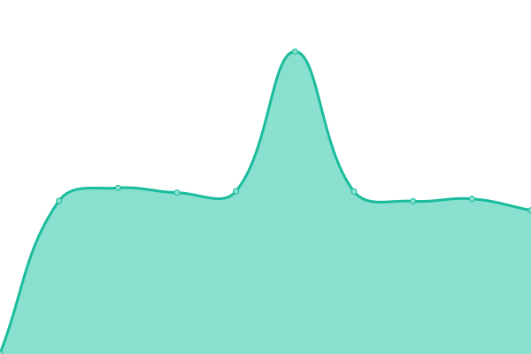

# [📈 Live Status](https://MatadorProBr.github.io/BetterCrewLink-status): <!--live status--> **🟩 All systems operational**

This repository contains the open-source uptime monitor and status page for [MatadorProBr](https://MatadorProBr.github.io/BetterCrewLink-status), powered by [Upptime](https://github.com/upptime/upptime).

With [Upptime](https://upptime.js.org), you can get your own unlimited and free uptime monitor and status page, powered entirely by a GitHub repository. We use [Issues](https://github.com/MatadorProBr/BetterCrewLink-status/issues) as incident reports, [Actions](https://github.com/MatadorProBr/BetterCrewLink-status/actions) as uptime monitors, and [Pages](https://MatadorProBr.github.io/BetterCrewLink-status) for the status page.

<!--start: status pages-->
<!-- This summary is generated by Upptime (https://github.com/upptime/upptime) -->
<!-- Do not edit this manually, your changes will be overwritten -->
<!-- prettier-ignore -->
| URL | Status | History | Response Time | Uptime |
| --- | ------ | ------- | ------------- | ------ |
|  [BetterCrewLink Voice Server](https://bettercrewl.ink) | 🟩 Up | [better-crew-link-voice-server.yml](https://github.com/MatadorProBr/BetterCrewLink-status/commits/HEAD/history/better-crew-link-voice-server.yml) | 

 485ms
     
 | 

<a href="https://MatadorProBr.github.io/BetterCrewLink-status/history/better-crew-link-voice-server">100.00%</a>
    

|  [BetterCrewLink Web](https://web.bettercrewl.ink) | 🟩 Up | [better-crew-link-web.yml](https://github.com/MatadorProBr/BetterCrewLink-status/commits/HEAD/history/better-crew-link-web.yml) | 

 601ms
     
 | 

<a href="https://MatadorProBr.github.io/BetterCrewLink-status/history/better-crew-link-web">100.00%</a>
    

|  [BetterCrewLink OBS Overlay](https://obs.bettercrewlink.app) | 🟩 Up | [better-crew-link-obs-overlay.yml](https://github.com/MatadorProBr/BetterCrewLink-status/commits/HEAD/history/better-crew-link-obs-overlay.yml) | 

 480ms
     
 | 

<a href="https://MatadorProBr.github.io/BetterCrewLink-status/history/better-crew-link-obs-overlay">100.00%</a>
    

|  [BetterCrewLink Short URL](https://bettercrewlink.app) | 🟩 Up | [better-crew-link-short-url.yml](https://github.com/MatadorProBr/BetterCrewLink-status/commits/HEAD/history/better-crew-link-short-url.yml) | 

 927ms
     
 | 

<a href="https://MatadorProBr.github.io/BetterCrewLink-status/history/better-crew-link-short-url">100.00%</a>
    

<!--end: status pages-->

[**Visit our status website →**](https://MatadorProBr.github.io/BetterCrewLink-status)

## 📄 License

- Powered by: [Upptime](https://github.com/upptime/upptime)
- Code: [MIT](./LICENSE) © [MatadorProBr](https://MatadorProBr.github.io/BetterCrewLink-status)
- Data in the `./history` directory: [Open Database License](https://opendatacommons.org/licenses/odbl/1-0/)
