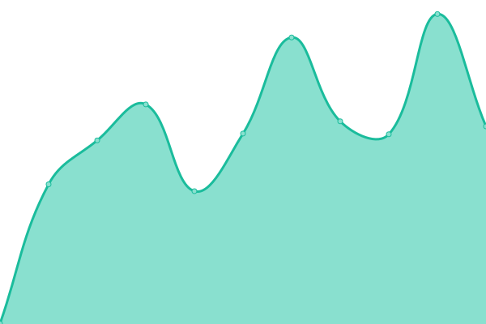
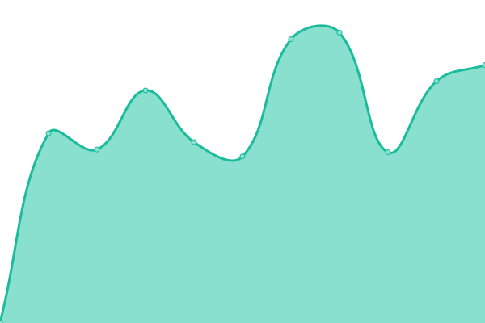

# BetterCrewLink Status

Welcome to **BetterCrewLink**'s Status repository

A status site for our services, some important and mod-needed (Voice Server, Web, OBS Overlay and Mirror) and some vanity / non-important (Short URL)

## [📈 Status](https://bettercrewlink-status.netlify.app/)

#### Live Status: <!--live status--> 🟩 All systems operational

<!--start: status pages-->
<!-- This summary is generated by Upptime (https://github.com/upptime/upptime) -->
<!-- Do not edit this manually, your changes will be overwritten -->
<!-- prettier-ignore -->
| URL | Status | History | Response Time | Uptime |
| --- | ------ | ------- | ------------- | ------ |
|  [Voice Server](https://bettercrewl.ink/) | 🟩 Up | [voice-server.yml](https://github.com/MatadorProBr/BetterCrewLink-status/commits/HEAD/history/voice-server.yml) | 

 488ms
     
 | 

<a href="https://bettercrewlink-status.netlify.app/history/voice-server">100.00%</a>
    

|  [Web Version](https://web.bettercrewl.ink/) | 🟩 Up | [web-version.yml](https://github.com/MatadorProBr/BetterCrewLink-status/commits/HEAD/history/web-version.yml) | 

 521ms
     
 | 

<a href="https://bettercrewlink-status.netlify.app/history/web-version">100.00%</a>
    

|  [OBS Overlay](https://obs.bettercrewlink.app/) | 🟩 Up | [obs-overlay.yml](https://github.com/MatadorProBr/BetterCrewLink-status/commits/HEAD/history/obs-overlay.yml) | 

 497ms
     
 | 

<a href="https://bettercrewlink-status.netlify.app/history/obs-overlay">100.00%</a>
    

|  [Mirror](https://mirror.bettercrewl.ink/) | 🟩 Up | [mirror.yml](https://github.com/MatadorProBr/BetterCrewLink-status/commits/HEAD/history/mirror.yml) | 

 526ms
     
 | 

<a href="https://bettercrewlink-status.netlify.app/history/mirror">100.00%</a>
    

|  [Short URL](https://bettercrewlink.app/) | 🟩 Up | [short-url.yml](https://github.com/MatadorProBr/BetterCrewLink-status/commits/HEAD/history/short-url.yml) | 

 992ms
     
 | 

<a href="https://bettercrewlink-status.netlify.app/history/short-url">100.00%</a>
    

<!--end: status pages-->

[**Visit our status website →**](https://bettercrewlink-status.netlify.app/)

## 📄 License

- Code: [MIT](./LICENSE)
- Data in the <a href="https://github.com/MatadorProBr/BetterCrewLink-status/tree/master/history">`/history`</a> directory: [Open Database License](https://opendatacommons.org/licenses/odbl/1-0/)
- Powered by: [Upptime](https://github.com/upptime/upptime)
