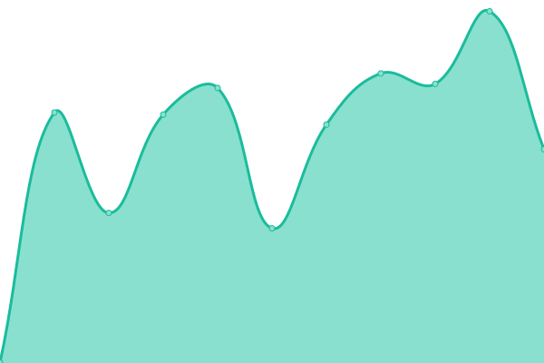

 

  
   
  Logo made by <a href="https://github.com/SirBuvex">SirBuvex</a>

<h1 align="center">BetterCrewLink Status</h1>

  <a href="https://github.com/MatadorProBr/BetterCrewLink-status/actions?query=workflow%3A%22Uptime+CI%22"></img></a>
  <a href="https://github.com/MatadorProBr/BetterCrewLink-status/actions?query=workflow%3A%22Response+Time+CI%22"></img></a>
  <a href="https://github.com/MatadorProBr/BetterCrewLink-status/actions?query=workflow%3A%22Graphs+CI%22"></img></a>
  <a href="https://github.com/MatadorProBr/BetterCrewLink-status/actions?query=workflow%3A%22Static+Site+CI%22"></img></a>
  <a href="https://github.com/MatadorProBr/BetterCrewLink-status/actions?query=workflow%3A%22Summary+CI%22"></img></a>
  <a href="https://app.netlify.com/sites/bettercrewlink-status/deploys"></img></a>

A [Upptime](https://github.com/upptime/upptime) repository status for [BetterCrewLink](https://github.com/OhMyGuus/BetterCrewLink), some important and mod-needed ([Voice Server](https://bettercrewlink-status.netlify.app/history/voice-server), [Web](https://bettercrewlink-status.netlify.app/history/web-version), [Offsets](https://bettercrewlink-status.netlify.app/history/offsets-git-hub), [Updater](https://bettercrewlink-status.netlify.app/history/updater-git-hub), [Hats](https://bettercrewlink-status.netlify.app/history/hats-git-hub), [OBS Overlay](https://bettercrewlink-status.netlify.app/history/obs-overlay) and [Mirror](https://bettercrewlink-status.netlify.app/history/mirror)) and some vanity / non-important ([GitHub Release Redirector](https://bettercrewlink-status.netlify.app/history/git-hub-release-redirector))

## [📈 Status](https://bettercrewlink-status.netlify.app/)

#### <!--live status--> **🟧 Partial outage**

<!--start: status pages-->
<!-- This summary is generated by Upptime (https://github.com/upptime/upptime) -->
<!-- Do not edit this manually, your changes will be overwritten -->
<!-- prettier-ignore -->
| URL | Status | History | Response Time | Uptime |
| --- | ------ | ------- | ------------- | ------ |
|  [Voice Server](https://bettercrewl.ink/) | 🟥 Down | [voice-server.yml](https://github.com/MatadorProBr/BetterCrewLink-status/commits/HEAD/history/voice-server.yml) | 

 491ms
     
 | 

<a href="https://bettercrewlink-status.netlify.app/history/voice-server">99.33%</a>
    

|  [Web Version](https://web.bettercrewl.ink/) | 🟥 Down | [web-version.yml](https://github.com/MatadorProBr/BetterCrewLink-status/commits/HEAD/history/web-version.yml) | 

 461ms
     
 | 

<a href="https://bettercrewlink-status.netlify.app/history/web-version">99.31%</a>
    

|  [Offsets (GitHub)](https://api.github.com/repos/OhMyGuus/BetterCrewlink-Offsets) | 🟩 Up | [offsets-git-hub.yml](https://github.com/MatadorProBr/BetterCrewLink-status/commits/HEAD/history/offsets-git-hub.yml) | 

 135ms
     
 | 

<a href="https://bettercrewlink-status.netlify.app/history/offsets-git-hub">100.00%</a>
    

|  [Updater (GitHub)](https://api.github.com/repos/OhMyGuus/BetterCrewLink/releases) | 🟩 Up | [updater-git-hub.yml](https://github.com/MatadorProBr/BetterCrewLink-status/commits/HEAD/history/updater-git-hub.yml) | 

 464ms
     
 | 

<a href="https://bettercrewlink-status.netlify.app/history/updater-git-hub">100.00%</a>
    

|  [Hats (GitHub)](https://api.github.com/repos/OhMyGuus/BetterCrewLink-Hats) | 🟩 Up | [hats-git-hub.yml](https://github.com/MatadorProBr/BetterCrewLink-status/commits/HEAD/history/hats-git-hub.yml) | 

 81ms
     
 | 

<a href="https://bettercrewlink-status.netlify.app/history/hats-git-hub">100.00%</a>
    

|  [OBS Overlay](https://obs.bettercrewlink.app/) | 🟥 Down | [obs-overlay.yml](https://github.com/MatadorProBr/BetterCrewLink-status/commits/HEAD/history/obs-overlay.yml) | 

 394ms
     
 | 

<a href="https://bettercrewlink-status.netlify.app/history/obs-overlay">99.27%</a>
    

|  [Mirror](https://mirror.bettercrewl.ink/) | 🟥 Down | [mirror.yml](https://github.com/MatadorProBr/BetterCrewLink-status/commits/HEAD/history/mirror.yml) | 

 579ms
     
 | 

<a href="https://bettercrewlink-status.netlify.app/history/mirror">99.25%</a>
    

|  [GitHub Release Redirector](https://bettercrewlink.app/) | 🟥 Down | [git-hub-release-redirector.yml](https://github.com/MatadorProBr/BetterCrewLink-status/commits/HEAD/history/git-hub-release-redirector.yml) | 

 877ms
     
 | 

<a href="https://bettercrewlink-status.netlify.app/history/git-hub-release-redirector">99.23%</a>
    

<!--end: status pages-->

[**Visit our status website →**](https://bettercrewlink-status.netlify.app/)

## 📄 License

- Code: [MIT](./LICENSE)
- Data in the <a href="https://github.com/MatadorProBr/BetterCrewLink-status/tree/master/history">`/history`</a> directory: [Open Database License](https://opendatacommons.org/licenses/odbl/1-0/)
- Powered by: [Upptime](https://github.com/upptime/upptime)
