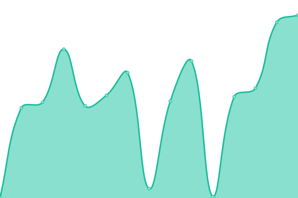
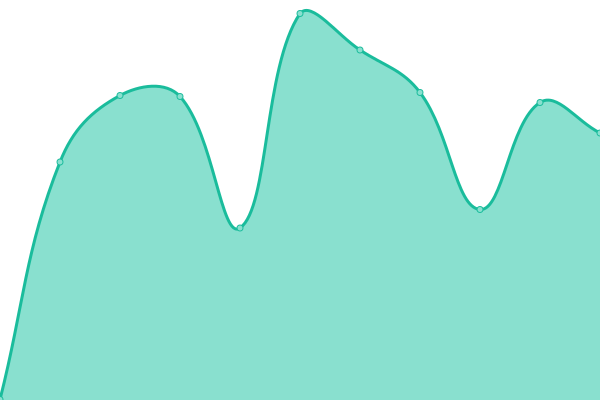

> **Warning**\
> This repository is not maintained anymore, the reason behind this is because Upptime is giving much false positives, instead use: https://status.bettercrewl.ink/

 

  
   
  Logo made by <a href="https://github.com/SirBuvex">SirBuvex</a>

<h1 align="center">BetterCrewLink Status</h1>

  <a href="https://github.com/MatadorProBr/BetterCrewLink-status/actions?query=workflow%3A%22Uptime+CI%22"></img></a>
  <a href="https://github.com/MatadorProBr/BetterCrewLink-status/actions?query=workflow%3A%22Response+Time+CI%22"></img></a>
  <a href="https://github.com/MatadorProBr/BetterCrewLink-status/actions?query=workflow%3A%22Graphs+CI%22"></img></a>
  <a href="https://github.com/MatadorProBr/BetterCrewLink-status/actions?query=workflow%3A%22Static+Site+CI%22"></img></a>
  <a href="https://github.com/MatadorProBr/BetterCrewLink-status/actions?query=workflow%3A%22Summary+CI%22"></img></a>
  <a href="https://github.com/MatadorProBr/BetterCrewLink-status/actions?query=workflow%3A%22pages-build-deployment%22"></img></a>
  
A [Upptime](https://github.com/upptime/upptime) repository status for [BetterCrewLink](https://github.com/OhMyGuus/BetterCrewLink) that checks every single BetterCrewLink service ([Voice Server](https://bettercrewlink-status.netlify.app/history/voice-server), [Web](https://bettercrewlink-status.netlify.app/history/web-version), [Offsets](https://bettercrewlink-status.netlify.app/history/offsets-git-hub), [Updater](https://bettercrewlink-status.netlify.app/history/updater-git-hub), [Hats](https://bettercrewlink-status.netlify.app/history/hats-git-hub), [OBS Overlay](https://bettercrewlink-status.netlify.app/history/obs-overlay) and [Mirror](https://bettercrewlink-status.netlify.app/history/mirror)) to see if it's up or down.

## [📈 Status](https://bettercrewlink-status.netlify.app/)

#### <!--live status--> **🟩 All systems operational**

<!--start: status pages-->
<!-- This summary is generated by Upptime (https://github.com/upptime/upptime) -->
<!-- Do not edit this manually, your changes will be overwritten -->
<!-- prettier-ignore -->
| URL | Status | History | Response Time | Uptime |
| --- | ------ | ------- | ------------- | ------ |
|  [Voice Server](https://bettercrewl.ink/) | 🟩 Up | [voice-server.yml](https://github.com/MatadorProBr/BetterCrewLink-status/commits/HEAD/history/voice-server.yml) | 

 508ms
     
 | 

<a href="https://bettercrewlink-status.netlify.app/history/voice-server">100.00%</a>
    

|  [Web Version](https://web.bettercrewl.ink/) | 🟩 Up | [web-version.yml](https://github.com/MatadorProBr/BetterCrewLink-status/commits/HEAD/history/web-version.yml) | 

 587ms
     
 | 

<a href="https://bettercrewlink-status.netlify.app/history/web-version">100.00%</a>
    

|  [Offsets (GitHub)](https://api.github.com/repos/OhMyGuus/BetterCrewlink-Offsets) | 🟩 Up | [offsets-git-hub.yml](https://github.com/MatadorProBr/BetterCrewLink-status/commits/HEAD/history/offsets-git-hub.yml) | 

 167ms
     
 | 

<a href="https://bettercrewlink-status.netlify.app/history/offsets-git-hub">99.83%</a>
    

|  [Updater (GitHub)](https://api.github.com/repos/OhMyGuus/BetterCrewLink/releases) | 🟩 Up | [updater-git-hub.yml](https://github.com/MatadorProBr/BetterCrewLink-status/commits/HEAD/history/updater-git-hub.yml) | 

 584ms
     
 | 

<a href="https://bettercrewlink-status.netlify.app/history/updater-git-hub">99.83%</a>
    

|  [Hats (GitHub)](https://api.github.com/repos/OhMyGuus/BetterCrewLink-Hats) | 🟩 Up | [hats-git-hub.yml](https://github.com/MatadorProBr/BetterCrewLink-status/commits/HEAD/history/hats-git-hub.yml) | 

 98ms
     
 | 

<a href="https://bettercrewlink-status.netlify.app/history/hats-git-hub">99.83%</a>
    

|  [OBS Overlay](https://obs.bettercrewlink.app/) | 🟩 Up | [obs-overlay.yml](https://github.com/MatadorProBr/BetterCrewLink-status/commits/HEAD/history/obs-overlay.yml) | 

 475ms
     
 | 

<a href="https://bettercrewlink-status.netlify.app/history/obs-overlay">100.00%</a>
    

|  [Mirror](https://mirror.bettercrewl.ink/) | 🟩 Up | [mirror.yml](https://github.com/MatadorProBr/BetterCrewLink-status/commits/HEAD/history/mirror.yml) | 

 535ms
     
 | 

<a href="https://bettercrewlink-status.netlify.app/history/mirror">100.00%</a>
    

<!--end: status pages-->

[**Visit our status website →**](https://bettercrewlink-status.netlify.app/)

## 📄 License

- Code: [MIT](./LICENSE)
- Data in the <a href="https://github.com/MatadorProBr/BetterCrewLink-status/tree/master/history">`/history`</a> directory: [Open Database License](https://opendatacommons.org/licenses/odbl/1-0/)
- Powered by: [Upptime](https://github.com/upptime/upptime)
